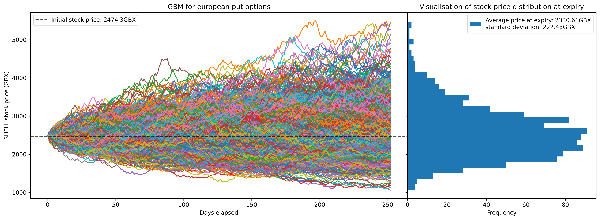

# Monte Carlo Option Pricing

A Python implementation of **Monte Carlo option pricing** using Geometric Brownian Motion (GBM), developed to explore how stochastic processes can be used to price financial derivatives and investigate the resulting numerical behaviour.

The notebook uses daily log returns from Shell's historical closing prices (2010-2025) to estimate annualised volatility ($\sigma$), then runs a risk-neutral GBM simulation over a 1 year time period using the one-year SONIA rate as the risk-free rate ($r$). Discounted option payoffs of each simulated terminal price are used to calculate an estimated option $V_{MC}$ price which is then compared to the analytical Black-Scholes price $V_{BS}$. The convergence of $V_{MC}$ to $V_{BS}$ is then investigated, alongside the theoretical $O(N^{-1/2})$ convergence rate of Monte Carlo's standard error. Finally, antithetic variates are implemented as a variance-reduction technique and the resulting reduction in estimator variance is quantified.

## Results

| Experiment                                            |     Result |
| ----------------------------------------------------- | ---------: |
| Monte Carlo error vs Black-Scholes ($N=1,000$)        |  **0.72%** |
| Experimental convergence exponent                     | **-0.494** |
| Estimator variance reduction with antithetic variates |  **72.4%** |

The Monte Carlo estimate is within **0.72%** of the Black-Scholes price using 1,000 simulations. Increasing the number of simulations causes the Monte Carlo estimate to converge towards the analytical solution.

A log-log regression of Monte Carlo standard error against the number of simulations gives a convergence exponent of **-0.494**, closely matching the theoretical value of $-0.5$.

Using antithetic variates with the same number of simulated paths reduces the observed estimator variance by **72.4%** compared with ordinary Monte Carlo.

### GBM Simulation

The simulated GBM paths and resulting terminal price distribution are shown below.

### Monte Carlo Convergence

The Monte Carlo estimate converges towards the analytical Black-Scholes price as the number of simulations increases.
The standard error decreases as the number of simulations increases. A linear regression on the log-log relationship gives an experimental convergence exponent of **-0.494**, close to the theoretical value of $-0.5$.

### Antithetic Variates

Antithetic variates were implemented by generating paired paths using $Z$ and $-Z$. The negative correlation between the paired simulations reduces the variance of the estimator.

Using the same number of simulated paths, antithetic variates reduced estimator variance by **72.4%** compared with ordinary Monte Carlo.

## Motivation

Monte Carlo methods provide a useful way of approaching problems where an analytical solution is impossible or very complex to obtain. I built this project to understand how the technique is applied, and to gain insight into financial derivatives and their role in financial markets.

The European option case also provides a useful validation problem. Under the same GBM assumptions, Black-Scholes provides an analytical solution, allowing the Monte Carlo implementation to be quantitatively tested against a known result.

## Method

### Geometric Brownian Motion

The stock price is modelled using Geometric Brownian Motion:

$$
dS_t = rS_tdt + \sigma S_tdW_t
$$

where $r$ is the risk-free rate, $\sigma$ is the annualised volatility and $W_t$ is a Wiener process under the risk-neutral measure.

The exact solution is used to simulate stock-price paths:

$$
S_{t+\Delta t} =
S_t\exp\left[
\left(r-\frac{1}{2}\sigma^2\right)\Delta t
+\sigma\sqrt{\Delta t}Z
\right]
$$

where $Z\sim N(0,1)$.

Historical Shell prices from 2010-2025 are used to estimate $\sigma$ from daily log returns. The simulation then uses the risk-neutral drift $r$, rather than the historical stock-price drift. This allows the option value to be estimated as the discounted expected payoff.

### Monte Carlo Pricing

For a European put, the payoff at maturity is:

$$
\max(K-S_T,0)
$$

The Monte Carlo price is estimated by averaging the discounted payoffs across $N$ simulated paths:

$$
V_{MC} =
e^{-rT}\frac{1}{N}
\sum_{i=1}^{N}\max(K-S_T^{(i)},0)
$$

The resulting estimate is compared against the Black-Scholes analytical solution.

### Convergence

The number of simulations is varied to investigate how the accuracy of the Monte Carlo estimator changes with $N$.

The standard error is calculated as:

$$
SE = \frac{s}{\sqrt{N}}
$$

where $s$ is the sample standard deviation of the discounted payoffs.

A log-log plot of standard error against $N$ is used to estimate the experimental convergence rate. Linear regression is performed on the logarithms of the two quantities, with the resulting gradient compared to the theoretical value of $-0.5$.

### Antithetic Variates

Antithetic variates are implemented as a variance-reduction technique. For every randomly generated vector $Z$, a corresponding $-Z$ vector is used to generate a second path.

The negative correlation between the paired simulations causes their payoffs to partially offset each other, reducing the variance of the estimator without requiring additional independent random samples.

The variance of the discounted payoff estimator is compared between ordinary Monte Carlo and the antithetic implementation to quantify the reduction.

## Implementation

The project is implemented in Python using **NumPy, SciPy, Matplotlib and yfinance**.

The `OptionPricer` class implements:

* Geometric Brownian Motion path generation
* Black-Scholes pricing
* European and Asian put/call payoff calculation
* Monte Carlo pricing &mdash; with an option for antithetic variates
* Visualisation of the GBM path and the terminal price distribution

The analysis and visualisations are contained in `main.ipynb`, with the `OptionPricer` class contained in `utils.py`.

## Option Types

The framework supports both **European and Asian call and put options**.

European options depend only on the terminal stock price, while Asian options depend on the average stock price over the simulated path. The latter provides a basis for extending the framework to path-dependent derivatives where analytical pricing solutions may not be available.

The main analysis focuses on the European put because the Black-Scholes solution provides a direct analytical benchmark for validating the Monte Carlo implementation.

## Key Takeaways

* Monte Carlo pricing produced a European put price within **0.72%** of Black-Scholes using 1,000 simulations.
* The experimental standard error convergence exponent of **-0.494** closely matches the theoretical $O(N^{-1/2})$ convergence rate.
* Antithetic variates reduced estimator variance by **72.4%** using the same number of simulated paths.
* The results demonstrate both the flexibility of Monte Carlo methods and their relatively slow convergence.
* The framework can be extended to path-dependent options and alternative stochastic models.

## Future Plans

* Generalise the `OptionPricer` class into a more flexible pricing framework.
* Add additional variance-reduction methods such as control variates.
* Add support for alternative models, such as **jump-diffusion** and **stochastic volatility**.
* Investigate pricing accuracy and computational efficiency across different models.
* Extend the framework to more complex and path-dependent derivatives.

